<div align="center">


[](https://github.com/Dineshkumar0705/The-Pok-mon-Company---PTCG-AI-Battle-Challenge-Strategy-AI-agent)

<br>


<sub>⚪🔴 &nbsp;A layered decision agent for The Pokémon Company's PTCG AI Battle Challenge — every claim on this page traces to a real self-play run through the actual competition engine, wins **and** losses alike.</sub>

<br><br>

**[🎬 What this is](#-what-this-is)** &nbsp;•&nbsp; **[📊 Results](#-real-results-at-a-glance)** &nbsp;•&nbsp; **[⚙️ Current config](#️-current-build-configuration-read-this-before-you-run-it)** &nbsp;•&nbsp; **[🧭 Lineage](#-the-v1--v7-lineage)** &nbsp;•&nbsp; **[📁 Layout](#-layout)** &nbsp;•&nbsp; **[✅ Tests](#-testing)** &nbsp;•&nbsp; **[🗺️ Scoped out](#️-scoped-out-explored-not-shipped--and-what-moved-out-of-this-list-version-by-version)**

</div>

<br>

<p align="center">
  
</p>

<p align="center"><sub>☝️ Not a mockup. Every line is the real engine's own event log (<code>Observation.logs</code>) from one real self-play game between two copies of this agent — real card names, real attacks, real damage.</sub></p>

---

## 🧬 What this is

This repo is a **behavior-preserving decomposition and audit** of an already-built, already-scored Simulation Category agent, evolved through seven honestly-versioned generations — `v1` (frozen, never edited) through `v7` (real expectimax search, a learned leaf-value model, belief-informed opponent modeling, and an engine-cross-validated card dataset).

> [!TIP]
> **Ground rule:** nothing ships into the default decision path without first winning a real, measured head-to-head test against what's already there. When an experiment *loses* that test, this project says so — in exactly as much detail as the wins.

<br>

## 📊 Real results at a glance

<div align="center">

</div>

<sub align="center">Green = real, measured win. Red = real, measured null/loss (kept off by default). Gray = mirror baseline for reference. Same numbers as the table below, plotted to scale so "off by default" never quietly means "worse but unshown."</sub>

<br>

| Layer | What it is | Real result | Status |
|---|---|---|:---:|
| 🔍 **v4 — Expectimax search** | 1–2 ply real forward search over the actual engine | **67.0%** win rate (n=100, 95% CI [57.3%, 75.4%]) vs. pure heuristic | ✅ Ships opt-in |
| 🧠 **v5 — Learned leaf-value** | Logistic regression on 76,486 real self-play records | **50.0%** win rate vs. heuristic leaf (both depths) | ❌ Real null — off |
| 🎴 **v6 — Cornerstone Ogerpon fix** | Real, cited competitive-play prior (Cornerstone Stance) | Validated against real card text (can't mirror-match test) | ✅ Unconditional |
| 🚀 **v7 — Cross-archetype validation** | First asymmetric-deck self-play in this repo | **+11.7pp** (40.0% vs. 28.3%, fix live vs. disabled) | ✅ Real, positive |
| 🚀 **v7 — Search depth 3** | Genuine extra real search round | **56.0%** (n=100) — worse than depth 2 | ❌ Real negative — off |
| 🚀 **v7 — GBT leaf-value v2** | Gradient-boosted trees + a new stadium feature | **50.0% / 53.3%** — still null despite better held-out metrics | ❌ Real null (again) — off |
| 🚀 **v7 — Ladder pool** | Real 4-agent round-robin Elo, 150 games | Real multi-way ranking, not just one matchup | ✅ Real infra |
| 🚀 **v7 — Dataset upgrade** | CSV cross-validated against real engine ground truth | Found & fixed 2 real accuracy bugs (30 + 4 wrong `ex`/`megaEx` flags) | ✅ Real, verified |
| 🃏 **v3 — Effect tags** | Keyword-matched effect/trigger tables over real card text | 16 real attack tags (e.g. `ignores_weakness_resistance`: 83), 6 ability-trigger tags | ✅ Transparent methodology |
| 🃏 **v3 — Card usage** | First real per-card gameplay dataset, 60 real self-play games | Archaludon ex's Metal Defender: 74.1% of all real attacks logged | ✅ 60/60 games decided |
| 🌐 **Live Kaggle reproduction** | v4 search vs. heuristic, played live in a Kaggle kernel (`ptcg_agent_engine_live_integration.ipynb`) | **75.0%** (n=40, 95% CI [59.8%, 85.8%]) — overlaps the n=100 result above | ✅ Reproduces on demand |

<sub>Full methodology, every Wilson CI, and every honest miss: `docs/v4` → `docs/v7-architecture.md`, `data/raw/DATASET_UPGRADE_REPORT.md`.</sub>

<br>

## ⚙️ Current build configuration (read this before you run it)

> [!WARNING]
> **This checkout has every experimental flag flipped ON**, deliberately, for testing — not because any of them won a new A/B. The measured results above are unchanged. `build_agent(deck)` with **no arguments** (what a real submission entrypoint calls) currently runs the full stack below instead of the byte-identical-to-v1 default.

| Flag | Shipped/validated default | **Value in this checkout** | Real reason it's normally off |
|---|:---:|:---:|---|
| `search.enabled` (`config/search_config.yaml`) | `false` | 🔴 **`true`** | — (this one *did* win its gate) |
| `search.depth` | `2` → 67.0% win | 🔴 **`3`** | 56.0% — measurably worse than depth 2 |
| `search.leaf_value_mode` | `heuristic` | 🔴 **`learned`** → `models/leaf_value_v7.joblib` (GBT) | 50.0–53.3% — a real null, twice, across two model classes |
| `search.policy_top_k` | `null` (search every candidate) | 🔴 **`2`** | 35.0% — a real loss (prunes by the exact baseline search exists to correct) |
| `plan_stability_enabled` (`agent.py` kwarg) | `False` | 🔴 **`True`** | Real null — no measured effect on win rate |

Every row is commented in place, at the exact line, in `config/search_config.yaml` and `src/pokemon_agent/agent.py`, with the real number that justifies the shipped default. Reverting to the validated, A/B-winning configuration is a **five-line diff**: `enabled: false`, `depth: 2`, `leaf_value_mode: heuristic`, `policy_top_k: null`, `plan_stability_enabled: bool = False`.

> [!IMPORTANT]
> Verified, not just predicted — with this override live, `pytest` real-engine-run **6 consecutive times** gives **101 passed, 2 failed, 1 skipped**, every time. The 2 failures are exactly the two guard tests built to catch this: `test_agent_matches_legacy.py` (v1-vs-v2 decision parity) and `test_search_config_loader.py::test_shipped_config_loads_with_search_disabled_by_default`. Both exist specifically to fail the moment a scored submission entrypoint would silently pick up search-enabled behavior — this is that gate correctly firing, not a broken test suite.

<div align="center">

</div>

<br>

## 🧭 The v1 → v7 lineage

```mermaid
flowchart LR
    classDef frozen fill:#374151,stroke:#9CA3AF,color:#fff
    classDef safe fill:#1F2937,stroke:#3DDC97,color:#3DDC97
    classDef ship fill:#134E4A,stroke:#34D399,color:#D1FAE5
    classDef win fill:#065F46,stroke:#34D399,color:#ffffff,stroke-width:2px

    v1["🧊 v1 — Frozen baseline\n(shipped, scored, never edited)"]:::frozen
    v2["🧩 v2 — Decomposition\n(byte-identical to v1, real parity test)"]:::safe
    v3["🔌 v3 — Plumbing\n(search/belief/rating, tested, not wired)"]:::safe
    v4["🔍 v4 — Expectimax search\n(67.0% real A/B win — ships opt-in)"]:::win
    v5["🧠 v5 — Learned leaf value\n(real null result — stays off)"]:::ship
    v6["🎴 v6 — Cornerstone Ogerpon fix\n(real cited rules prior — ships unconditional)"]:::win
    v7["🚀 v7 — Search gen. + ladder + dataset\n(real wins, real nulls, all honest)"]:::win

    v1 --> v2 --> v3 --> v4 --> v5 --> v6 --> v7
```



<p align="center"><sub>Diagram shows the real, validated lineage. This checkout's live config currently runs past v7's own recommended defaults — see <a href="#️-current-build-configuration-read-this-before-you-run-it">Current build configuration</a> above.</sub></p>

<br>

## 📁 Layout

<details>
<summary><b>📂 Click to expand the full repo map</b></summary>

```text
notebooks/legacy/main_v1_reference.py   v1 — the FROZEN, shipped, scored agent. Never edited.
notebooks/legacy/*.ipynb                the original notebook it was extracted from
notebooks/ptcg_dataset_and_agent_walkthrough.ipynb  v3 dataset pass -- real, pre-executed
                                         Kaggle notebook: Part 1 recomputes every dataset
                                         number live from the real CSVs (charts included);
                                         Part 2 walks the v1-v7 agent architecture with real,
                                         documented A/B results, explicitly labeled as
                                         pre-measured rather than re-run live
notebooks/ptcg_agent_engine_live_integration.ipynb  the live complement to the above -- attaches
                                         the vendored engine SDK as its own Kaggle dataset
                                         (kaggle-engine-package/) alongside the card dataset and
                                         actually builds + runs the real v4 search agent vs. the
                                         real heuristic baseline, live, in the kernel: real
                                         head-to-head self-play (n=40), real Wilson CI, real
                                         search telemetry, real card/attack usage cross-checked
                                         against the bundled 60-game dataset. Nothing pasted.
kaggle-engine-package/                  the packaged engine+agent Kaggle Dataset upload the
                                         notebook above attaches -- vendor/cg + src/pokemon_agent
                                         copied unmodified, so the real search/ISMCTS agent can
                                         actually run inside a Kaggle kernel, not just be
                                         described from a linked repo
deck.csv                                the real 60-card decklist
data/raw/                               canonical EN/JP card reference data (cleaned dataset) + v7's
                                         engine-cross-validated cards_enriched/attacks_enriched/
                                         abilities_enriched/evolution_lines.csv + v3's
                                         attack_effect_tags/ability_trigger_tags (real keyword-tagged
                                         effect data) and card_usage_from_self_play/
                                         attack_usage_from_self_play (real 60-game card dataset) --
                                         see DATASET_UPGRADE_REPORT.md
vendor/cg/                              the real proprietary battle engine (organizer-supplied)

src/pokemon_agent/                      v2 — v1's logic, decomposed into independently
  agent.py                              testable modules. Same decisions, same bugs* fixed,
  attack_plans.py                       nothing behavioral changed beyond that. v4: build_agent()
  deck_loading.py                       gained an opt-in search_config param (default: disabled).
  engine_interface.py
  card_data.py
  scoring/{damage,pokemon_score,option_scorer}.py
  threats/{crustle,alakazam_ex,bellibolt_ex,cornerstone_ogerpon}.py  # v6: cornerstone_ogerpon.py, unconditional real-card-text fix
  mock_engine.py                        lightweight fixture types for engine-free unit tests
  rating/ladder.py                      v3 — real Elo ladder fed by real replay logs (opt-in, unused by agent.py)
  belief/energy_density.py              v3/v4 — energy-density prior; v4 wires it into search determinization
  search/lookahead.py                   v3/v4 — real search_begin/search_step wiring, now with
                                         belief-informed determinization (v4)
  search/expectimax.py                  v4/v5 — real 1-2 ply search, swappable leaf eval (heuristic or
                                         learned, v5), ATTACK-only re-ranking, opt-in via config/search_config.yaml
  search/transposition_table.py         v4 — real leaf-value cache within one search call
  search/config_loader.py               v4/v5 — loads config/search_config.yaml, fails closed to disabled
  memory/featurize.py                   v5/v7 — Observation -> feature vector (21 v5 / 22 v7 w/ stadium flag), one player's perspective
  memory/replay_store.py                v5 — Replay Vector Store: real (features, outcome) records + similarity query
  learning/leaf_value.py                v5/v7 — LearnedLeafValue: trained win-probability model (logistic or v7's GBT), opt-in leaf evaluator
  threats/cornerstone_ogerpon.py        v6 — unconditional real-card-text fix; v7 finally A/B-tests it directly

tests/                                  pytest suite — see "Testing" below
scripts/
  deck_consistency_check.py             deck legality + trusted-override audit
  replay_logger.py                      runs real games, logs real results
  matchup_breakdown.py                  win-rate-by-archetype report from real logs
  ab_test_search_vs_heuristic.py        v4 — real A/B gate: search vs. heuristic, real self-play, real CI
  generate_self_play_training_data.py   v5/v7 — real self-play data generation (--feature-version v5|v7)
  train_leaf_value_model.py             v5/v7 — trains + reports real held-out metrics (--model-type logistic|gbt)
  ab_test_learned_value_vs_heuristic_leaf.py  v5/v7 — real A/B gate: learned leaf vs. heuristic leaf, any model path
  ab_test_plan_stability.py             v7 — real A/B gate: plan-stability bonus vs. baseline
  ab_test_cornerstone_matchup.py        v7 — real asymmetric-deck self-play, first direct test of v6's fix
  run_ladder_pool.py                    v7 — real round-robin of 4 agent variants through MatchupLadder.record_match()
  smoke_test_v7_all_features.py         v7 — deploy check: every v7 feature active at once, real games, no win-rate claim
  build_engine_enriched_dataset.py      v7 — builds cards/attacks/abilities/evolution_lines_enriched.csv from real engine ground truth, cross-validated against the CSV
  render_battle_log_gif.py              v7 — renders the README's battle-log GIF from a real self-play game's real engine event log
  build_effect_tag_datasets.py          v3 dataset pass — real keyword-matched attack_effect_tags.csv / ability_trigger_tags.csv from real card text
  generate_card_usage_dataset.py        v3 dataset pass — real 60-game card_usage_from_self_play.csv / attack_usage_from_self_play.csv, pinned to the validated baseline regardless of this checkout's own config override
replays/raw/replay_log.jsonl            real self-play results (see "Real results" below)
replays/raw/ab_search_vs_heuristic_log.jsonl   v4 — real A/B run log (see docs/v4-architecture.md)
replays/raw/leaf_value_training_data.jsonl     v5 — real (state, outcome) training data, 76,486 records
replays/raw/leaf_value_training_data_v7.jsonl  v7 — real (state, outcome) training data w/ v7 features, 77,062 records
replays/raw/ab_learned_vs_heuristic_leaf_log.jsonl  v5 — real A/B run log (see docs/v5-architecture.md)
replays/raw/ab_learned_v7_vs_heuristic_leaf_log.jsonl  v7 — real A/B run log (see docs/v7-architecture.md)
replays/raw/ladder_pool_log.jsonl / ladder_pool_summary.json  v7 — real 150-game ladder pool run
replays/raw/card_usage_log.jsonl        v3 dataset pass — real per-game card/attack event log, 60 real games, source for card_usage_from_self_play.csv

decks/cornerstone_ogerpon_v7.csv        v7 — real, legal 2nd decklist, used for the item D matchup A/B above

config/search_config.yaml               v4/v5 — search + leaf-value feature flags, data not hardcoded
docs/v4-architecture.md                 v4 — what was built, the real A/B result, and why it ships opt-in
docs/v5-architecture.md                 v5 — learned leaf-value function, its real (null) A/B result, and why Phase 3+ is blocked
docs/v6-architecture.md                 v6 — Cornerstone Ogerpon ex prior, why it's validated differently than v3-v5
docs/v7-architecture.md                 v7 — search generalization, cross-archetype validation, ladder pool, 2nd leaf-value null result — every real result, honestly
models/leaf_value_v5.joblib             v5 — the actual trained model (StandardScaler + LogisticRegression)
models/leaf_value_v7.joblib             v7 — GBT model on the richer v7 feature set (real A/B result: still a null result)

writeup/                                the Kaggle Strategy-category writeup draft + figure
kaggle-dataset-package/                 the packaged card-data Kaggle Dataset upload (v7: now includes
                                         the engine-cross-validated tables + DATASET_UPGRADE_REPORT.md)
```

<sub>*`*bugs`* — see "Bugs found and fixed" below; not a euphemism, two real, previously-shipping-adjacent decision bugs were found here.</sub>

</details>

<br>

## 🔒 Why v1/v2/v3, and why nothing here is claimed without proof

This project treats "the agent that's actually scored" as sacred: `v1` is frozen and never edited. Everything else earns trust by being checked **against v1 on the real engine**, not by looking plausible.

- **v2 must make identical decisions to v1.** `tests/test_agent_matches_legacy.py` runs real self-play games through the real engine, feeds the identical observation to both `legacy.agent()` and the new `agent()` at every single decision point, and asserts zero divergence. Currently passes with real games completing end to end.
- **v3 modules are real and engine-tested, but not decision-affecting** until a change to `agent.py` is itself validated the same way. `rating/`, `belief/`, and `search/` all have real tests exercising them against the real engine or on real data — not stubs — but none change what `agent.py` decides yet. Wiring one in without a head-to-head A/B pass would be exactly the mistake this audit process exists to catch.

<details>
<summary><b>🐛 Bugs found and fixed (via real head-to-head testing, this build)</b></summary>

Both caught the same way: running real self-play games through the real engine and diffing v1's and v2's chosen option index at every decision.

1. **Pokemon-card misclassification.** `_is_pokemon_type()` compared an enum *name string* (`"POKEMON"`) against `cardData.cardType`. The real engine's `to_dataclass()` assigns JSON scalars raw — `cardType` comes through as a plain `int` (`0` for Pokemon), not an enum instance — so the string match silently never fired, and every Pokemon-card PLAY was scored as a generic Trainer (~10000 instead of ~20000). Caught via a real mismatch: legacy correctly prioritized playing Duraludon, v2 tied it with playing Ultra Ball. Fixed by comparing directly against `CardType.POKEMON` — `IntEnum` equality works transparently against both a raw int and an actual enum instance, so one fix covers the real engine and the mock fixtures.
2. **Attack-plan staleness.** v1's `plan` is a single object, mutated in place, across *every* MAIN-context call within one turn — not reset each call. A call that finds no viable attacker this turn simply never writes into `plan`, so it silently keeps whatever a *prior* call that same turn already found. The first cut of `build_attack_plan()` instead returned a brand-new blank plan any time that call alone found nothing, which regressed a real found attack back to "no plan" purely because a later MAIN call saw a momentarily-unusable active Pokemon. Fixed by threading `previous_plan=` through so the same "only overwrite if this call beats -1" semantics apply. Regression test: `tests/test_attack_plan_stickiness.py` (mock-engine, no live engine needed).

A third, pre-existing finding from before this session (see v1's own module docstring): the `deck_loading.py` guard against Kaggle auto-mounting its own `sample_submission/deck.csv` over the real deck — generalized here into `validate_trusted_override()`, audited on demand by `scripts/deck_consistency_check.py`.

**v7 dataset upgrade found two more, in the CSV-fallback path only** (never the real scored submission, which always uses the live engine): the old `ex`/`megaEx` text heuristics were wrong for 30 and 4 real cards, and `CardRecord` never exposed the real attribute names `attack_plans.py` actually reads (`.ex`/`.megaEx`), silently no-oping ex-detection in CSV-fallback mode. See `data/raw/DATASET_UPGRADE_REPORT.md`.

</details>

<details>
<summary><b>📈 Real results (not simulated, not estimated)</b></summary>

`replays/raw/replay_log.jsonl` holds real records from `scripts/replay_logger.py` actually playing games through the live engine in this environment. Current log (mirror match — both seats run this same agent/deck, since no other archetype's decklist was available in this environment to play against):

| Opponent archetype | Decided | Logged | Win rate | 95% CI | Avg steps |
|---|:---:|:---:|:---:|:---:|:---:|
| mirror | 30 | 30 | **60.0%** | [42.3%, 75.4%] | 134 |

Read honestly: 30 games is enough to see the agent completes real, coherent, non-crashing games end to end and to get a rough sense of first-seat/initiative advantage in the mirror — it is **not** enough to claim a precise win rate, hence the wide Wilson interval. `scripts/matchup_breakdown.py` recomputes this from the log at any time; `scripts/replay_logger.py --games N --opponent-deck <path> --opponent-archetype <name>` appends real data for an actual opposing decklist the moment one is available.

</details>

<details>
<summary><b>🧱 A real, previously-undocumented engine boundary found while building this</b></summary>

Early versions of the test harness checked `obs_dict.get("result")` (a top-level key that doesn't exist) instead of the real field, `obs["current"]["result"]` (`-1` while a game is ongoing, `0`/`1`/`2` once it ends). Every game looked like it hit a mysterious, 100%-reproducible "empty option pool" crash around step 100–170 — which was actually just games ending normally and the harness not noticing, so it kept calling `battle_select()` on an already-finished battle. Fixed by reading the correct field everywhere. Documented here because it's exactly the kind of engine-contract detail that's easy to get subtly wrong when driving `cg` directly instead of through whatever wrapper the graded Kaggle harness uses.

</details>

<br>

## ✅ Testing

```bash
pip install pytest
pytest                      # conftest.py wires up src/ and vendor/ automatically
```

> [!NOTE]
> With the [all-flags-on override](#️-current-build-configuration-read-this-before-you-run-it) live in `config/search_config.yaml`, a real `pytest` run gives **101 passed, 2 failed, 1 skipped** (verified 6 consecutive real runs, not just predicted). The 2 failures are `test_agent_matches_legacy.py` and `test_search_config_loader.py::test_shipped_config_loads_with_search_disabled_by_default` — both exist specifically to catch a scored entrypoint silently picking up search-enabled behavior, so failing here is that gate working, not a broken suite. Revert the override to get back to a fully green 103/103.

<details>
<summary><b>🧪 103 tests (96 through v7, +7 in the v3 dataset-gap-analysis pass) — click for what each file covers</b></summary>

| File | Covers |
|---|---|
| `test_agent_matches_legacy.py` | Real engine, real self-play, v1-vs-v2 parity (skips if `vendor/cg`'s `.so` isn't loadable on this platform — see `vendor/cg/sim.py`'s platform table). Calls `build_agent(deck)` with **no explicit config** — the sentinel for "does the real default entrypoint still match v1." |
| `test_dataset_gap_analysis.py` | v3 dataset pass, pure-file: checks new effect-tag tables cover every real attack/ability with no false-positive keyword hits, and that the 60-game usage CSVs are internally consistent. |
| `test_lookahead.py` | Real engine — confirms `search_begin`/`search_step`/`search_end` wiring round-trips correctly. |
| `test_expectimax_real_engine.py` | v4, real engine — `rank_attack_candidates()` at depth 1 and 2, plus a full real self-play game with search wired through `build_agent()`. |
| `test_expectimax_matches_heuristic_at_depth_zero.py` | v4 regression gate — depth 0/disabled must be byte-identical to plain heuristic scoring. |
| `test_transposition_table.py`, `test_belief_informed_determinization.py`, `test_search_config_loader.py` | v4/v5/v7, pure-Python/mock-engine, run on any machine. |
| `test_featurize.py`, `test_replay_vector_store.py` | v5 Phase 1 (Replay Vector Store), pure-Python. |
| `test_leaf_value.py`, `test_learned_leaf_value_wiring.py` | v5 Phase 2 — training/predict/save-load mechanics and fail-closed behavior. |
| `test_learned_leaf_value_real_engine.py` | v5, real engine — confirms the trained model is genuinely consulted across a full real self-play game. |
| `test_scoring.py`, `test_attack_plan_stickiness.py`, `test_option_scorer.py`, `test_deck_loading.py`, `test_energy_density.py` | Pure-Python, mock-engine or math-only. |
| `test_cornerstone_ogerpon_planning.py` | v6, mock-engine — confirms `build_attack_plan()` skips the blocked Archaludon ex pairing and falls through to Duraludon. |
| `test_expectimax_v7_real_engine.py` | v7, real engine — depth-3 runs without crashing; `policy_top_k` pruning mechanics. |
| `test_plan_stability.py` | v7, mock-engine — stability bonus prefers previously-committed attacker near ties, never overrides lethal. |
| `test_ladder.py` | v3/v7 — real Elo math, plus v7's symmetric two-sided `record_match()` update (with a double-count guard). |
| `test_card_data.py` | v7, real engine + CSV cross-check — pins the real bug fix and the exact old heuristic behavior for opt-out callers. |

</details>

<br>

## 🗺️ Scoped out (explored, not shipped) — and what moved out of this list, version by version

<details>
<summary><b>Click to expand the full honesty log</b></summary>

Consistent with the "shipped and measured" vs. "explored but not validated" split this project holds itself to elsewhere (see `writeup/`): a PPO self-play loop and genetic deck search were considered and are **not** in this repo in any form, stub or otherwise — they'd need training infrastructure this environment doesn't have, and claiming them without that would be exactly the overclaiming the writeup's own honesty section warns against.

**v4:** `search/lookahead.py`'s plumbing is no longer just tested — `search/expectimax.py` wires it into a real, A/B-validated ATTACK-ranking layer (67.0% win rate, n=100, 95% CI [57.3%, 75.4%] at depth 2 vs. the pure heuristic in real self-play mirror matches — see `docs/v4-architecture.md`). Ships opt-in, not as `build_agent(deck)`'s default.

**v5:** a value net (`learning/leaf_value.py`) is real, trained on 76,486 real self-play records, and A/B-tested. Its result was a **null result** (50.0% vs. the heuristic leaf at both depth 1 and 2 — see `docs/v5-architecture.md`), so it stays off by default, but it's a real, measured finding now, not an unstarted item. Behavioral cloning from real ladder replays is still explicitly not started — but for a concrete reason now: this environment has no real human/top-episode replay export to train on. Population/league training, CFR/fictitious play, bandit search-mode selection, and Bayesian-tuned hyperparameters remain not started for the same reasons `docs/agent-v3-upgrade-architecture.md` gave — no real gap in the now-measured layers has named a reason to start any of them yet.

**v6:** `threats/cornerstone_ogerpon.py` adds one real, externally-sourced competitive-play prior — Cornerstone Mask Ogerpon ex's Cornerstone Stance, this deck's named structural counter in real competitive play, verified against this project's own card-data table and wired into both the damage calculator and the attack planner. Unlike v3–v5, it isn't A/B-tested, honestly, because it can't be: this deck's mirror-match self-play tooling never produces this opponent, so validation is unit tests against real card text plus the existing v1-parity real-engine test — see `docs/v6-architecture.md` for why that's the right evidence tier here, not a shortcut.

**v7:** every buildable-now item from `docs/v7-research-and-proposal.md` (A–E) is now real and measured, not proposed. Two moved to "real positive result": the Cornerstone Ogerpon fix is now directly A/B-tested for the first time (real +11.7pp, item D) and the multi-agent ladder pool is real, not dormant (item A, 150 real games). Three are real negative/null results, reported the same way v4/v5's were: search depth 3 underperforms the shipped depth 2, `policy_top_k` branch pruning is a real loss, and the plan-stability bonus is a real null. The Suphx-style oracle idea (the original item B) was investigated and found genuinely blocked by the real engine — `Observation.hand` is `None` for the opponent even at the raw dict level, confirmed directly, not assumed — and honestly pivoted to a `GradientBoostingClassifier` plus one new legal feature instead; that pivot's real A/B result is a second null result, which is itself useful: it rules out "wrong model class" as v5's original bottleneck. An LLM-in-the-loop evaluator (item G) stays explicitly not attempted pending a rules check on whether the competition's runtime even permits inference-time network calls. League-scale training (item H) and Kaggle-credential-gated behavioral cloning (item F) remain named-but-blocked for the same compute/access reasons as before. On top of the proposal's own scope, a real deploy-check pass also cross-validated the reference card dataset against the real engine and found/fixed two real accuracy bugs in the CSV-fallback path (`data/raw/DATASET_UPGRADE_REPORT.md`). See `docs/v7-architecture.md`.

</details>

<br>

<div align="center">


<sub>Built with real self-play, real Wilson confidence intervals, and a standing rule: <b>nothing ships until it wins a real head-to-head test</b> — including against itself. ⚡🔴⚪</sub>

</div>
