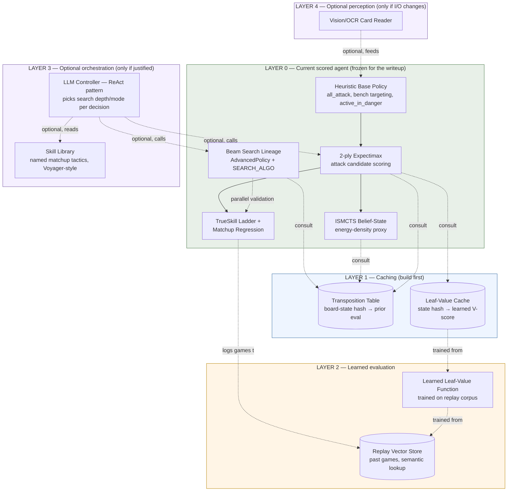

# PTCG Agent — Target Architecture (v-next)

*Sep 9, 2026 · Concrete build spec, synthesized from the two prior research reports (`strategy-writeup-research-report.md`, `next-gen-agent-architecture-research-report.md`)*

---

## 0. What's frozen vs. what this is

Your Strategy writeup (due Sep 13) must describe **only what's already shipped and measured** — the apextcg v26–v37 heuristic/expectimax/ISMCTS lineage and the probability-v2 beam-search lineage. **Nothing below changes that.** This document is the concrete build spec for the *next* version of the agent — what you build after the deadline, or for a future competition cycle. Layer 0 is your current system, unmodified; everything above it is new.

---

## 1. Design principles

1. **Never break Layer 0.** Every new module is additive and sits behind a feature flag — the current scored agent must keep running standalone at all times.
2. **Cheapest, most load-bearing module first.** Build order follows the priority table from the prior report: cache before learn, learn before orchestrate, orchestrate before perceive-differently.
3. **Every module earns its slot with a named failure it fixes.** If a module doesn't trace to a specific measured weakness (a bug, a slow search, a blind matchup), it doesn't get built yet — this is the same discipline your writeup already applies to card swaps.
4. **No module claims more than it does.** A cache is a cache, not a "world model." A vector lookup over past replays is a memory index, not opponent prediction. Keep the vocabulary precise — it's cheap now and expensive to walk back later if this system is ever written about again.

---

## 2. High-level architecture

L3 and L4 are shaded the same "optional" color deliberately — nothing in your current loss patterns has shown you need an LLM controller or a vision layer yet. They're in the diagram because you asked for them, not because they're justified today. Build L1 and L2 first; revisit L3/L4 only if a specific, named gap shows up that they'd actually close.

---

## 3. Component specs

### Layer 0 — unchanged
No new engineering here. This is your reference implementation and the regression baseline every new module must beat before it's allowed to replace anything.

### Layer 1 — Caching (build first, ~1–2 days of engineering)

**Transposition Table**
- *Problem it fixes:* your search re-evaluates board states it's already seen via a different move order within the same turn/search tree.
- *Interface:* `hash(board_state) -> {value, depth_searched, best_move}`. Zobrist-style incremental hashing (XOR-updateable per card played) so you don't re-hash the whole board every node.
- *Where it plugs in:* called at the top of every expectimax/ISMCTS/beam-search node, before doing any work — cache hit at depth ≥ current search depth returns immediately.
- *Eviction:* fixed-size LRU per game (cleared between games — a transposition table that persists across games with different decks is a correctness bug, not a feature).
- *Success metric:* nodes-evaluated-per-decision drops for the same search depth, or search depth increases for the same wall-clock budget. Either is a clean, measurable win to report internally.

**Leaf-Value Cache**
- *Problem it fixes:* once you have a learned value function (Layer 2), re-running it on identical leaf states is wasted inference.
- *Interface:* same hash key as the transposition table, separate small cache, invalidated whenever the value function is retrained.

### Layer 2 — Learned evaluation (build second, needs Layer 1's replay logging first)

**Replay Vector Store**
- *Problem it fixes:* your matchup-conditioned regression already uses replay data in aggregate; this makes individual past games retrievable by similarity ("games like this one") rather than only by summary statistics.
- *Interface:* embed `(board_state, opponent_archetype, outcome)` tuples; store in a lightweight vector index (even an in-memory FAISS/annoy index is enough at this data scale — no need for a hosted vector DB yet).
- *Honest framing:* this is a memory index, not a predictive model. Don't call it a "world model" internally or externally.

**Learned Leaf-Value Function**
- *Problem it fixes:* your current leaf evaluation in expectimax is hand-coded heuristics. A function trained on your own logged outcomes can pick up patterns the heuristics miss, without touching the search algorithm itself.
- *Interface:* `V(board_state) -> win_probability`, trained supervised on `(board_state, eventual_outcome)` pairs from the replay store. Drop-in replacement for the heuristic leaf-eval call inside expectimax/beam search — same call signature, so this is a low-risk swap you can A/B against Layer 0's heuristic.
- *Validation gate:* it does not replace the heuristic evaluator in the scored path until it beats it head-to-head over a statistically meaningful game count (use the same binomial-CI discipline from the writeup research — don't ship on a 20-game sample).

### Layer 3 — Optional orchestration (build only if justified)

**Skill Library**
- *Problem it would fix:* your matchup-specific detection logic (water decks, Crustle wall, stall) is currently hard-coded branches in the beam-search lineage. A skill library formalizes each as a named, independently-testable unit, closer to how Voyager accumulates reusable tactics.
- *When to actually build this:* once you have more than ~5–6 matchup-specific branches and hard-coding each new one is visibly slowing iteration — not before. Premature abstraction here costs more than the hard-coded version.

**LLM Controller (ReAct-pattern)**
- *Problem it would fix:* deciding, per-decision, whether to spend the compute budget on deep beam search vs. fast heuristic-only play — currently presumably a fixed policy.
- *When to actually build this:* only if you find specific decision points where a fixed search-depth policy is measurably wasting compute on easy decisions or under-searching hard ones. Read Anthropic's "Building Effective AI Agents" guidance again before starting this one specifically — it's the module most likely to add complexity without adding win rate.

### Layer 4 — Optional perception (build only if the I/O contract changes)

**Vision/OCR Card Reader**
- *Problem it would fix:* nothing, today — the competition provides structured CSV/state data, so there's no raw-pixel input to read. This module exists in the diagram only because it's a real, buildable thing (public Pokémon-card OCR models already exist) if a future environment ever hands you screenshots instead of structured state.

---

## 4. Per-turn data flow (once Layers 1–2 are live)

1. Engine hands agent the current board state.
2. State is hashed; transposition table is checked first — cache hit at sufficient depth short-circuits straight to a move.
3. On a miss, expectimax/ISMCTS/beam search runs as today, but every node checks the transposition table before expanding, and every leaf calls the learned value function (cached via the leaf-value cache) instead of (or blended with, during A/B validation) the hand-coded heuristic.
4. Move is played; outcome is eventually logged to the replay vector store once the game ends.
5. Periodically (offline, not per-turn): replay store feeds retraining of the learned value function; retrained function invalidates the leaf-value cache.
6. TrueSkill ladder and matchup regression run exactly as today, now with a larger and queryable replay corpus behind them.

Nothing in this flow requires Layer 3 or 4 — they're genuinely separable extensions, not load-bearing parts of the pipeline.

---

## 5. Build order / milestones

| Phase | Deliverable | Depends on | Est. effort |
|---|---|---|---|
| 1 | Transposition table wired into all three search modes | none — pure engineering | 1–2 days |
| 2 | Replay logging into a vector store (even a flat file + in-memory index to start) | Phase 1 (reuses the same state-hashing code) | 1 day |
| 3 | Learned leaf-value function, trained offline, A/B'd against the heuristic evaluator | Phase 2 (needs replay volume) | 3–5 days, mostly data/training iteration |
| 4 | Leaf-value cache | Phase 3 | <1 day |
| 5 (optional) | Skill library refactor of matchup branches | Only once branch count justifies it | variable |
| 6 (optional) | LLM controller | Only once a specific compute-allocation problem is identified | variable |
| 7 (optional) | Vision/OCR layer | Only if the I/O contract changes | variable |

Phases 1–4 are the real roadmap. 5–7 are contingent, not scheduled — don't put dates on them until the triggering condition actually shows up in your own data.

---

## 6. What to say about this in the writeup's Closing paragraph

Per your master prompt's ~100-word Closing budget, one honest sentence naming Phase 1 (transposition tables) and Phase 3 (a learned leaf-value function trained on your own replay data) as the next concrete, already-scoped steps is stronger than naming all seven phases — a judge skimming the notebook will credit two named, buildable next steps over a long list of module names with no build order behind them.
